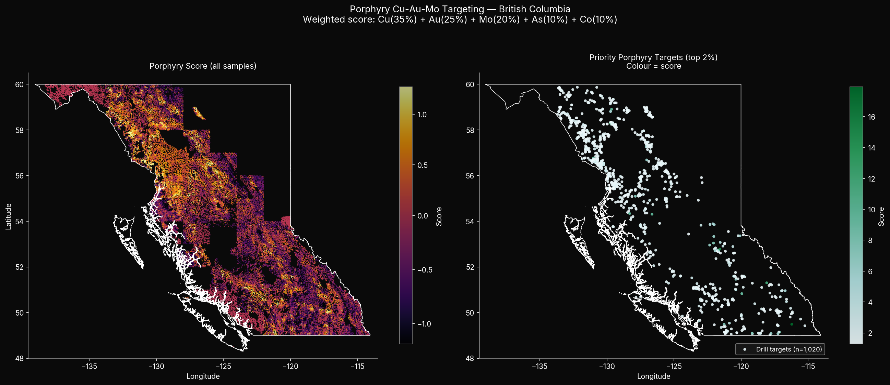
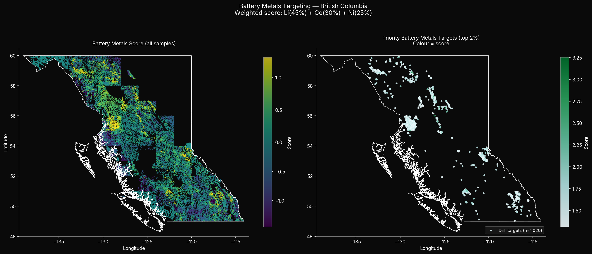
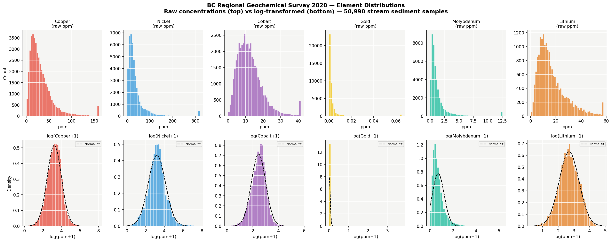
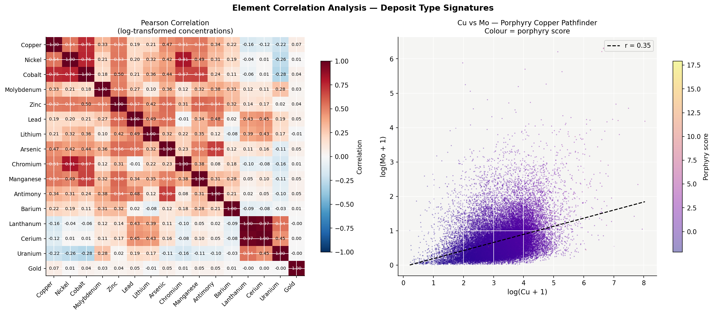

# BC Critical Minerals Drill Targeting Pipeline

An end-to-end geoscience data engineering and exploration targeting pipeline built on provincial geochemical data from British Columbia. The pipeline ingests 50,990 stream sediment samples from the BC Regional Geochemical Survey (RGS 2020), transforms them through six stages into ML-ready features, and produces ranked drill targets for two deposit types: porphyry Cu-Au-Mo systems and battery metals (Li-Co-Ni).

**[Live Demo →](https://your-app.streamlit.app)** *(coming soon)*

---

## Results

### Porphyry Cu-Au-Mo Targets


### Battery Metals Targets (Li-Co-Ni)


### Element Distributions


### Correlation Analysis


---

## Pipeline Architecture

The pipeline follows a linear 6-stage architecture. Each stage reads from the previous stage's GeoParquet output and writes its own. Each stage is independently testable and re-runnable.

```
BC RGS 2020 Excel
       ↓
01_ingest          → geochem_01_raw.parquet         (65,008 rows)
       ↓
02_standardise     → geochem_02_standardised.parquet (50,988 rows, stream sediment only)
       ↓
03_validate        → geochem_03_validated.parquet    (10/10 QA checks passing)
       ↓
04_spatial         → geochem_04_spatial.parquet      (geology, terranes, fault distances)
       ↓
05_features        → geochem_05_features.parquet     (127 columns, 2 targeting scores)
       ↓
06_visualise       → outputs/*.png                   (5 maps and charts)
```

---

## Data Sources

| Dataset | Source | Description |
|---|---|---|
| BC RGS 2020 | BC Geological Survey | 65,429 stream/lake/moss sediment samples, 63+ analytes |
| BC Bedrock Geology | BCGS Digital Geology 2019 | 35,424 bedrock polygons, rock class + terrane |
| BC Faults | BCGS Digital Geology 2019 | 57,279 fault features |
| BC Terranes | BCGS / YGS Colpron & Nelson 2013 | 180 terrane polygons, Cordilleran orogen |

All datasets are open government data released under the [BC Open Government Licence](https://www2.gov.bc.ca/gov/content/data/open-data/open-government-licence-bc).

---

## Key Engineering Decisions

**Media filter** — stream sediment only (`MAT = "Stream Sediment"` or `"Stream Sediment and Water"`). Lake sediment, moss, and water samples are excluded. Stream sediment is the standard for regional mineral exploration targeting and most comparable across survey vintages.

**Analyte method selection** — ICP as primary method for all elements. Gold uses a FA→ICP fallback chain (fire assay preferred for accuracy, ICP fills gaps). INA excluded from gold fallback due to 23,160 BDL substitutions introducing excess noise. This gives ~85% gold coverage, consistent with the ~14% null rate across other elements.

**Below-detection-limit handling** — negative values in the raw data indicate the element was measured below the instrument detection limit. Industry standard substitution: `abs(value) / 2`. Preserves the information that the element was present at a low level without introducing bias.

**Geology stratification** — local z-scores are computed within each `rock_class` (from BCGS bedrock geology). This removes lithological background variation. Ex 100 ppm Cu in sedimentary rock is more anomalous than 100 ppm Cu in intrusive rock.

**Spatial covariates** — distance to nearest fault and distance to nearest terrane boundary computed in BC Albers (EPSG:3005) for accurate metre-scale distances. Porphyry Cu-Au deposits in BC cluster along terrane boundaries (Stikinia/Quesnellia boundary hosts Highland Valley, Mount Polley, Gibraltar).

---

## Feature Engineering

99 features engineered across 8 categories:

| Category | Count | Description |
|---|---|---|
| Raw concentrations | 16 | Element values in ppm after BDL substitution |
| Log transforms | 16 | log1p — compresses 5 orders of magnitude |
| Global z-scores | 16 | Province-wide anomaly detection |
| Local z-scores | 16 | Rock-class stratified anomaly detection |
| Pathfinder ratios | 6 | Cu/Mo, Cu/Au, As/Au, Co/Ni, Cu/Zn, Li/Mn |
| Grid aggregates | 18 | Mean, max, std per 10km cell |
| Spatial features | 5 | Rock class, terrane, fault/boundary distances |
| Targeting outputs | 6 | Two scores, two ranks, two target flags |

### Targeting Scores

**Porphyry Cu-Au-Mo score** — targets large disseminated porphyry systems (Highland Valley, Mount Polley style):
```
score = Cu_z×0.35 + Au_z×0.25 + Mo_z×0.20 + As_z×0.10 + Co_z×0.10
```

**Battery metals score** — targets Li pegmatites and magmatic Ni-Co systems:
```
score = Li_z×0.45 + Co_z×0.30 + Ni_z×0.25
```

Top 2% by score flagged as priority drill targets — **1,020 porphyry targets** and **1,020 battery metals targets**.

---

## Top Drill Targets

### Porphyry Cu-Au-Mo

| Rank | Sample ID | Lat | Lon | Rock Class | Terrane | Cu (ppm) | Au (ppm) | Score |
|---|---|---|---|---|---|---|---|---|
| 1 | ID082F775131 | 49.49 | -116.22 | Sedimentary | N. America platformal | 9.5 | 40.6 | 17.92 |
| 2 | ID093A805067 | 52.78 | -121.58 | Metamorphic | N. America basinal | 20.8 | 19.4 | 15.14 |
| 3 | ID104I111457 | 58.30 | -129.74 | Volcanic | Stikinia | 126.8 | 9.6 | 12.49 |
| 4 | ID082M775164 | 51.30 | -118.08 | Sedimentary | N. America basinal | 21.5 | 9.7 | 11.74 |
| 5 | ID104G111187 | 57.97 | -131.47 | Sedimentary | Stikinia | 136.7 | 6.3 | 10.96 |

### Battery Metals (Li-Co-Ni)

| Rank | Sample ID | Lat | Lon | Rock Class | Terrane | Li (ppm) | Co (ppm) | Ni (ppm) | Score |
|---|---|---|---|---|---|---|---|---|---|
| 1 | ID094D961144 | 56.02 | -126.12 | Metamorphic | Cache Creek | 70.2 | 87.5 | 1177.1 | 3.25 |
| 2 | ID094C973372 | 56.53 | -124.80 | Sedimentary | Cassiar | 52.8 | 168.8 | 142.0 | 2.83 |
| 3 | ID104I955136 | 58.84 | -128.67 | Intrusive | Yukon-Tanana | 106.3 | 27.1 | 634.6 | 2.76 |
| 4 | ID103P787533 | 55.83 | -129.13 | Sedimentary | Stikinia | 31.2 | 160.7 | 440.9 | 2.75 |
| 5 | ID094E963294 | 57.29 | -126.33 | Sedimentary | Cassiar | 46.0 | 114.6 | 268.7 | 2.70 |

---

## Project Structure

```
critical-minerals-canada/
  scripts/
    01_ingest_geochemical.py
    02_standardise_geochemical.py
    03_geochemical_validation.py
    04_geochemical_spatial.py
    05_geochemical_features.py
    06_geochemical_visualisation.py
  data/
    rgs2020_data.csv              # BC RGS 2020 (not tracked in git)
    BC_digital_geology.gpkg       # not tracked in git
    BC_terranes.gpkg              # not tracked in git
    BC_boundary.gpkg              # not tracked in git
    geochem_01_raw.parquet        # not tracked in git
    geochem_02_standardised.parquet
    geochem_03_validated.parquet
    geochem_04_spatial.parquet
    geochem_05_features.parquet
  outputs/
    01_element_distributions.png
    02_copper_anomaly_map.png
    03_porphyry_targets.png
    04_battery_targets.png
    05_correlation_heatmap.png
    geochem_validation_report.json
    geochem_metadata.yaml
  pixi.toml
  README.md
```

---

## Setup

This project uses [pixi](https://pixi.sh) for environment management.

```bash
git clone https://github.com/your-username/critical-minerals-canada
cd critical-minerals-canada
pixi install
```

Download the source data (links above) and place in `data/`. Then run each stage in order:

```bash
pixi run python scripts/01_ingest_geochemical.py
pixi run python scripts/02_standardise_geochemical.py
pixi run python scripts/03_geochemical_validation.py
pixi run python scripts/04_geochemical_spatial.py
pixi run python scripts/05_geochemical_features.py
pixi run python scripts/06_geochemical_visualisation.py
```

---

## Next Steps

The current pipeline produces a rule-based composite score — a weighted sum of element z-scores designed from literature review. The natural next step is replacing this with a supervised ML model:

**Labels** — BC MINFILE (the provincial mineral occurrence database) contains ~18,000 known mineral occurrences with deposit type, commodity, and coordinates. These can be used as positive training labels, with background samples as negatives.

**Model** — XGBoost or Random Forest trained on the 99 engineered features to predict deposit probability. The rule-based score becomes a baseline to beat.

**Spatial cross-validation** — standard k-fold CV would leak information since nearby geochemical samples are spatially autocorrelated. Proper evaluation requires spatial or block cross-validation to give honest out-of-sample performance estimates.

**Satellite integration** — multispectral and SAR imagery (Landsat, Sentinel-1/2) can add surface mineralogy and structural features (lineaments, alteration zones) as additional covariates, particularly useful where geochemical coverage is sparse.

**Uncertainty quantification** — the current score has no confidence intervals. A probabilistic model (e.g. calibrated Random Forest or a Bayesian approach) would let the exploration team prioritise targets by both expected value and uncertainty.

---

## Author

Rex Deverex - Geospatial Data Scientst 
Background in remote sensing, ML pipelines, and geospatial analysis. Prior geoscience fieldwork at the Geological Survey of Canada.
