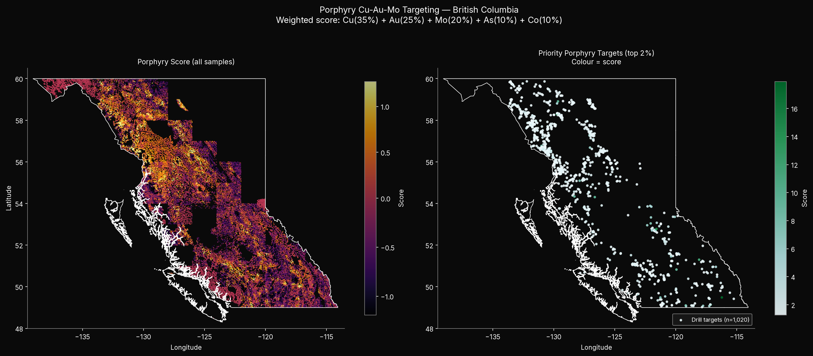
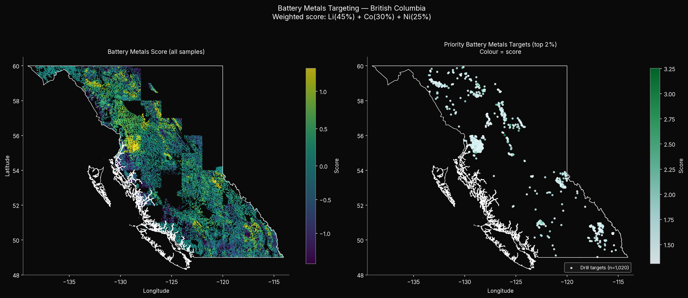
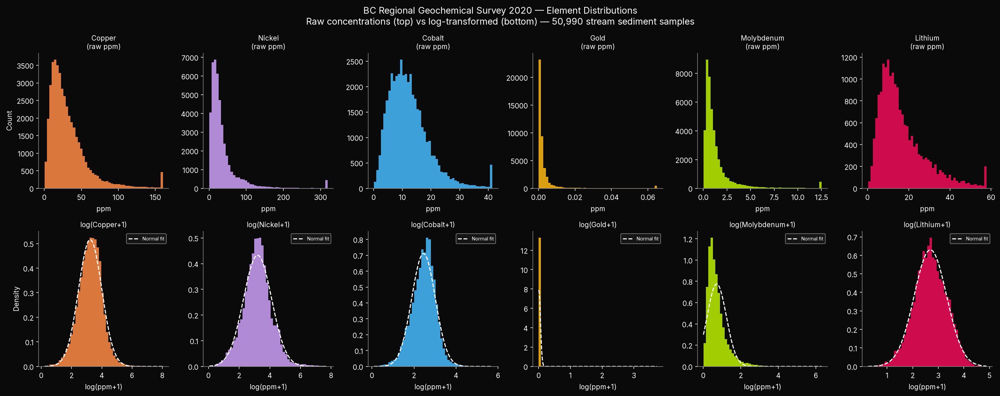
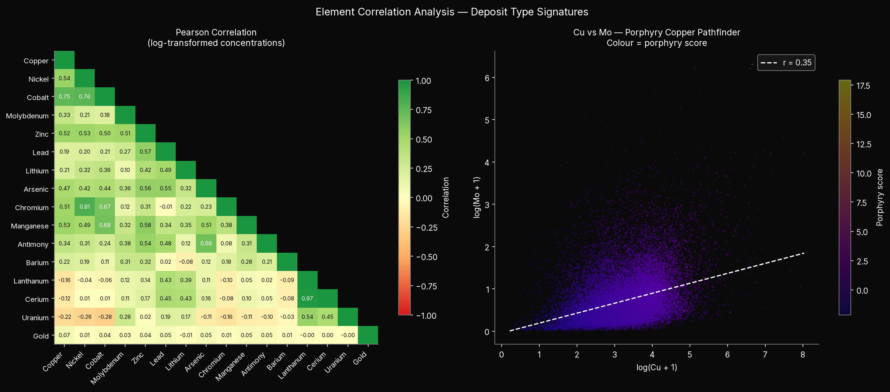

# BC Critical Minerals Drill Targeting Pipeline

An end-to-end geoscience data engineering and exploration targeting pipeline built on provincial geochemical data from British Columbia. The pipeline ingests 50,990 stream sediment samples from the BC Regional Geochemical Survey (RGS 2020), transforms them into ML-ready features, joins province-wide mineral occurrence labels, landform and terrain covariates, and produces ranked drill targets for two deposit types: porphyry Cu-Au-Mo systems and battery metals (Li-Co-Ni).


---

## Results

### Porphyry Cu-Au-Mo Targets


### Battery Metals Targets (Li-Co-Ni)


### Element Distributions


### Correlation Analysis


---

## Pipeline Architecture

Eleven stages, each a pixi task. Each stage reads the previous stage's GeoParquet/GeoTIFF output and writes its own, so every stage is independently testable and re-runnable — and pixi skips any stage whose inputs haven't changed.

```
Geochemistry (BC RGS 2020)
01_ingest_geochem        → data/geochem_01_raw.parquet          (65,008 rows)
02_standardise_geochem   → data/geochem_02_standardised.parquet (50,988 rows, stream sediment only)
03_validate_geochem      → data/geochem_03_validated.parquet    (10/10 QA checks passing)
04_spatial_geochem       → data/geochem_04_spatial.parquet      (geology, terranes, fault distances)
05_features_geochem      → data/geochem_05_features.parquet     (127 columns, 2 rule-based scores)
06_visualise_geochem     → outputs/geochem/*.png                (5 maps and charts)

Province-wide covariates & labels
07_get_minfile           → data/minfile_bc_raw.parquet          (16,261 mineral occurrences)
08_get_terrain_inventory → data/terrain_inventory_bc_raw.parquet (158,201 TIM landform polygons)
09_get_dem_geomorphometry→ outputs/geomorphometry/{dem,tpi,landforms}.tif (Copernicus DEM, 90 m)
10_prep_geophysics       → outputs/geophysics/{rtf,1vd,as,tdr}.tif (magnetics + analytic signal + tilt derivative, 100 m)


Modelling table
11_build_hex_grid        → data/hex_grid.parquet                (~207k H3 res-7 hexes: every layer summarised per hex + labels)
```

---

## Data Sources

| Dataset | Source | Description |
|---|---|---|
| BC RGS 2020 | BC Geological Survey | 65,429 stream/lake/moss sediment samples, 63+ analytes |
| BC Bedrock Geology | BCGS Digital Geology 2019 | 35,424 bedrock polygons, rock class + terrane |
| BC Faults | BCGS Digital Geology 2019 | 57,279 fault features |
| BC Terranes | BCGS / YGS Colpron & Nelson 2013 | 180 terrane polygons, Cordilleran orogen |
| BC MINFILE | BC Geological Survey (DataBC WFS) | 16,261 mineral occurrences with deposit type + commodity codes |
| Terrain Inventory Mapping (TIM) | BC Ministry of Environment (DataBC WFS) | 158,201 surficial material / landform polygons, ~50% of BC |
| Copernicus DEM GLO-90 | ESA via Microsoft Planetary Computer | 90 m elevation, basis for TPI and landform classification |
| BC Aeromagnetic Compilation | GSC Open File 9222 / BCGS Open File 2024-08 | 100 m residual total field + first vertical derivative (manual download, Geosoft GRD) |

All datasets are open government data released under the [BC Open Government Licence](https://www2.gov.bc.ca/gov/content/data/open-data/open-government-licence-bc).

---

## Key Engineering Decisions

**Media filter** — stream sediment only (`MAT = "Stream Sediment"` or `"Stream Sediment and Water"`). Lake sediment, moss, and water samples are excluded. Stream sediment is the standard for regional mineral exploration targeting and most comparable across survey vintages.

**Analyte method selection** — ICP as primary method for all elements. Gold uses a FA→ICP fallback chain (fire assay preferred for accuracy, ICP fills gaps). INA excluded from gold fallback due to 23,160 BDL substitutions introducing excess noise. This gives ~85% gold coverage, consistent with the ~14% null rate across other elements.

**Below-detection-limit handling** — negative values in the raw data indicate the element was measured below the instrument detection limit. Industry standard substitution: `abs(value) / 2`. Preserves the information that the element was present at a low level without introducing bias.

**Geology stratification** — local z-scores are computed within each `rock_class` (from BCGS bedrock geology). This removes lithological background variation. Ex 100 ppm Cu in sedimentary rock is more anomalous than 100 ppm Cu in intrusive rock.

**Spatial covariates** — distance to nearest fault and distance to nearest terrane boundary computed in BC Albers (EPSG:3005) for accurate metre-scale distances. Porphyry Cu-Au deposits in BC cluster along terrane boundaries (Stikinia/Quesnellia boundary hosts Highland Valley, Mount Polley, Gibraltar).

---

## Feature Engineering

99 features engineered across 8 categories:

| Category | Count | Description |
|---|---|---|
| Raw concentrations | 16 | Element values in ppm after BDL substitution |
| Log transforms | 16 | log1p — compresses 5 orders of magnitude |
| Global z-scores | 16 | Province-wide anomaly detection |
| Local z-scores | 16 | Rock-class stratified anomaly detection |
| Pathfinder ratios | 6 | Cu/Mo, Cu/Au, As/Au, Co/Ni, Cu/Zn, Li/Mn |
| Grid aggregates | 18 | Mean, max, std per 10km cell |
| Spatial features | 5 | Rock class, terrane, fault/boundary distances |
| Targeting outputs | 6 | Two scores, two ranks, two target flags |

### Targeting Scores

**Porphyry Cu-Au-Mo score** — targets large disseminated porphyry systems (Highland Valley, Mount Polley style):
```
score = Cu_z×0.35 + Au_z×0.25 + Mo_z×0.20 + As_z×0.10 + Co_z×0.10
```

**Battery metals score** — targets Li pegmatites and magmatic Ni-Co systems:
```
score = Li_z×0.45 + Co_z×0.30 + Ni_z×0.25
```

Top 2% by score flagged as priority drill targets — **1,020 porphyry targets** and **1,020 battery metals targets**.

---

## Top Drill Targets

### Porphyry Cu-Au-Mo

| Rank | Sample ID | Lat | Lon | Rock Class | Terrane | Cu (ppm) | Au (ppm) | Score |
|---|---|---|---|---|---|---|---|---|
| 1 | ID082F775131 | 49.49 | -116.22 | Sedimentary | N. America platformal | 9.5 | 40.6 | 17.92 |
| 2 | ID093A805067 | 52.78 | -121.58 | Metamorphic | N. America basinal | 20.8 | 19.4 | 15.14 |
| 3 | ID104I111457 | 58.30 | -129.74 | Volcanic | Stikinia | 126.8 | 9.6 | 12.49 |
| 4 | ID082M775164 | 51.30 | -118.08 | Sedimentary | N. America basinal | 21.5 | 9.7 | 11.74 |
| 5 | ID104G111187 | 57.97 | -131.47 | Sedimentary | Stikinia | 136.7 | 6.3 | 10.96 |

### Battery Metals (Li-Co-Ni)

| Rank | Sample ID | Lat | Lon | Rock Class | Terrane | Li (ppm) | Co (ppm) | Ni (ppm) | Score |
|---|---|---|---|---|---|---|---|---|---|
| 1 | ID094D961144 | 56.02 | -126.12 | Metamorphic | Cache Creek | 70.2 | 87.5 | 1177.1 | 3.25 |
| 2 | ID094C973372 | 56.53 | -124.80 | Sedimentary | Cassiar | 52.8 | 168.8 | 142.0 | 2.83 |
| 3 | ID104I955136 | 58.84 | -128.67 | Intrusive | Yukon-Tanana | 106.3 | 27.1 | 634.6 | 2.76 |
| 4 | ID103P787533 | 55.83 | -129.13 | Sedimentary | Stikinia | 31.2 | 160.7 | 440.9 | 2.75 |
| 5 | ID094E963294 | 57.29 | -126.33 | Sedimentary | Cassiar | 46.0 | 114.6 | 268.7 | 2.70 |

---

## Project Structure

```
critical-minerals-canada/
  scripts/                        # the pipeline — one numbered script per stage
    01_ingest_geochem.py … 11_build_hex_grid.py
  site_specific/                  # parked for later single-deposit models
    get_satellite_imagery.py      # Landsat alteration indices for one AOI
  notebooks/                      # exploration only, not part of the pipeline
  data/                           # all inputs + intermediate parquet (not tracked in git)
  outputs/
    geochem/                      # maps, charts, QA report, target GeoJSONs
    geomorphometry/               # DEM, TPI, landforms rasters (not tracked — 600 MB+ each)
    geophysics/                   # magnetics RTF, 1VD, analytic signal, tilt derivative (not tracked)
    satellite/                    # site-specific alteration indices
  pixi.toml                       # environment + pipeline tasks
```

---

## Setup

This project uses [pixi](https://pixi.sh) for environment management.

```bash
git clone https://github.com/your-username/critical-minerals-canada
cd critical-minerals-canada
pixi install
```

Download the RGS 2020, bedrock geology, terrane, and BC boundary files (links above) into `data/`. MINFILE, TIM, and the DEM are fetched automatically. The aeromagnetic grids are a manual download from the [NRCan Geophysical Data portal](https://geophysical-data.canada.ca/Portal/) — choose **Geosoft GRD** (not TIF) for the BC Compilation 100 m residual total field and 1st vertical derivative, and unzip into `data/geophysical/`. Then run the whole pipeline:

```bash
pixi run pipeline
```

Or any single stage (its upstream stages run first if needed): `ingest`, `standardise`, `validate`, `spatial`, `features`, `visualise`, `minfile`, `terrain`, `dem`, `geophysics`, `hex-grid`.

```bash
pixi run hex-grid
```

The `dem` stage peaks at ~12 GB RAM.

---

## Modelling

Training and prediction are tracked in MLflow. Settings live in `configs/`; copy a config to try a variation.

```bash
pixi run mlflow-ui                                      # leave running; UI at http://127.0.0.1:5000
pixi run train                                          # configs/porphyry_cuau.yaml
pixi run train --config configs/<variant>.yaml
pixi run predict --model-uri runs:/<run_id>/model       # or models:/porphyry_cuau_prospectivity/<version>
pixi run tune                                          # Optuna search → writes configs/porphyry_cuau_tuned.yaml
pixi run train --config configs/porphyry_cuau_tuned.yaml
```

**Tuning** (`configs/porphyry_cuau_tuning.yaml`) scores every Optuna trial with the same spatial-CV folds as training, on the training blocks only, so the held-out test blocks stay unseen until the final `train` run. Each trial is a nested MLflow run under one tuning parent run.

**Evaluation is spatial.** Hexes are grouped into H3 resolution-4 blocks (~45 km) and whole blocks are held out, stratified so the test set contains deposits. A random hex split would leak through neighbour features and shared mineral districts. Metrics: PR-AUC (primary — ~1% positives), ROC-AUC, and the share of known deposits captured in the top 1/5/10/20% of area, each compared against the rule-based `score_porphyry_max`.

**Every run logs** the config, resolved feature list, git commit (plus the uncommitted diff if any), data and lockfile hashes, spatial-CV and test metrics, capture curve, split map, permutation importance, and the model (registered as `<commodity>_prospectivity`). Prediction runs are tagged with the model run they used and write a QGIS layer to `outputs/predictions/`.

---

## Next Steps

The current pipeline produces a rule-based composite score — a weighted sum of element z-scores designed from literature review. The natural next step is replacing this with a supervised ML model:

**Labels** — BC MINFILE (the provincial mineral occurrence database) contains ~18,000 known mineral occurrences with deposit type, commodity, and coordinates. These can be used as positive training labels, with background samples as negatives.

**Model** — XGBoost or Random Forest trained on the 99 engineered features to predict deposit probability. The rule-based score becomes a baseline to beat.

**Spatial cross-validation** — standard k-fold CV would leak information since nearby geochemical samples are spatially autocorrelated. Proper evaluation requires spatial or block cross-validation to give honest out-of-sample performance estimates.

**Satellite integration** — multispectral and SAR imagery (Landsat, Sentinel-1/2) can add surface mineralogy and structural features (lineaments, alteration zones) as additional covariates, particularly useful where geochemical coverage is sparse.

**Uncertainty quantification** — the current score has no confidence intervals. A probabilistic model (e.g. calibrated Random Forest or a Bayesian approach) would let the exploration team prioritise targets by both expected value and uncertainty.

---

## Author

Rex Deverex - Geospatial Data Scientst 
Background in remote sensing, ML pipelines, and geospatial analysis. Prior geoscience fieldwork at the Geological Survey of Canada.
